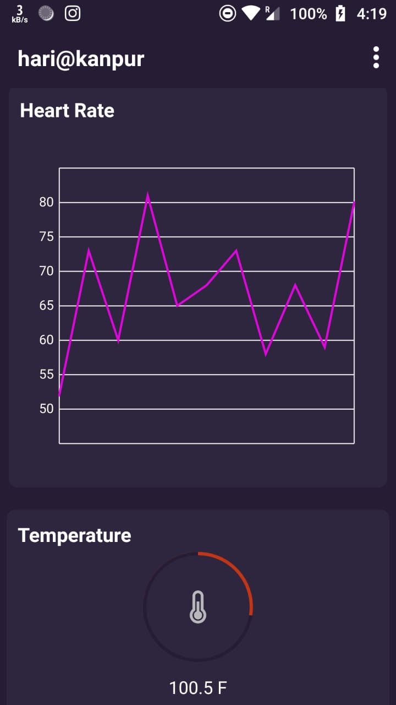
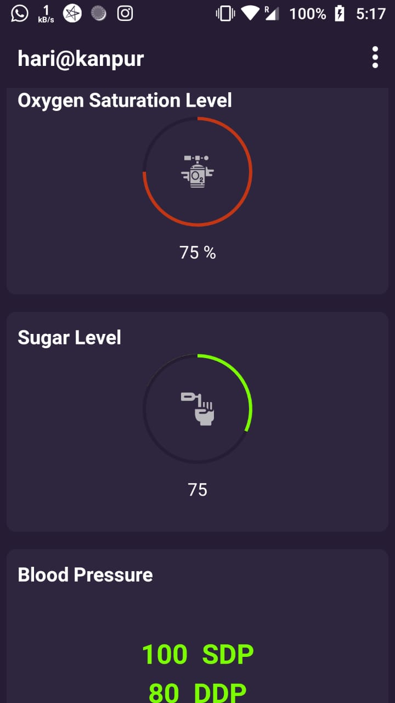
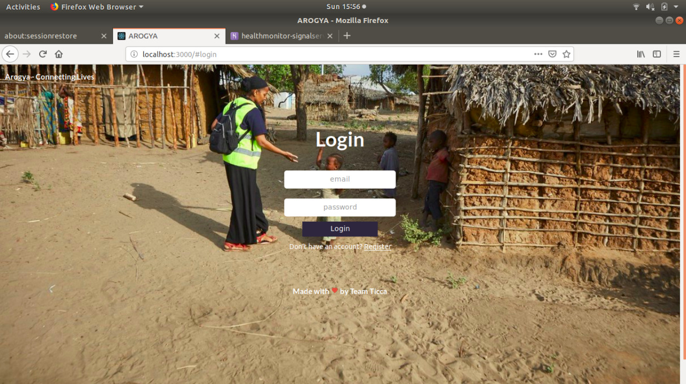
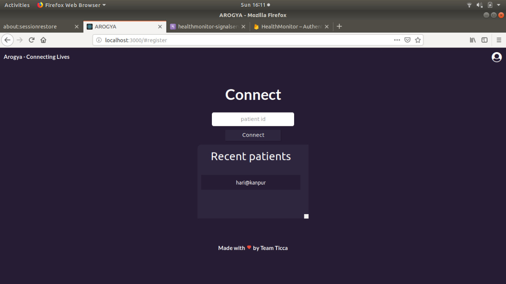
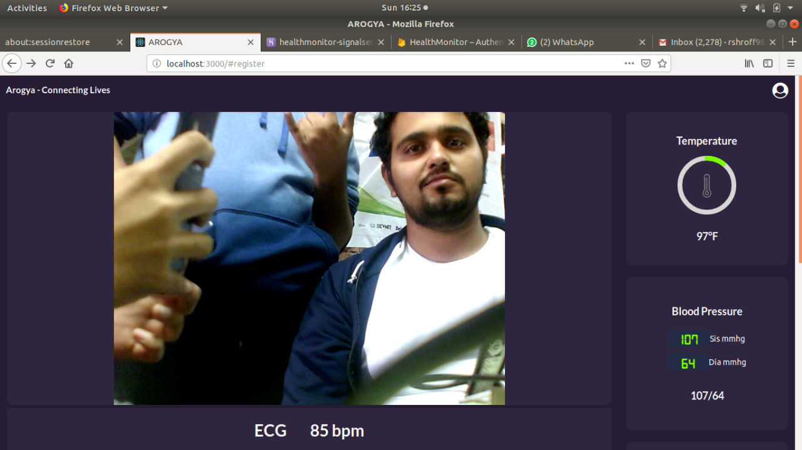
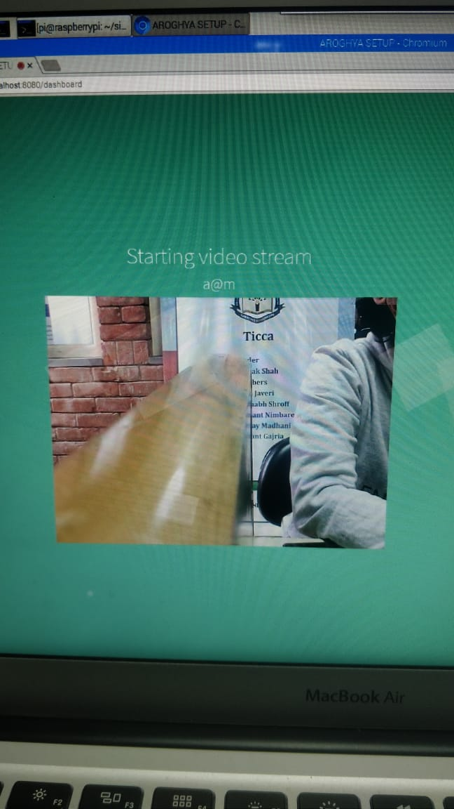
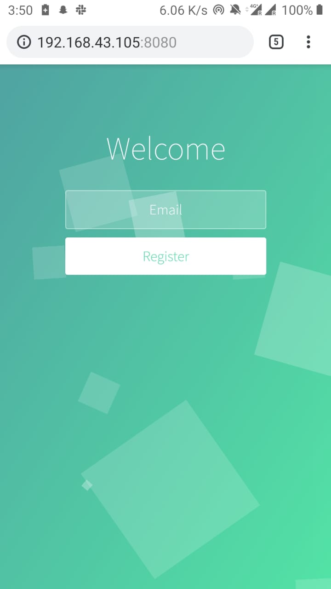

# Arogya
> SIH 2019 Project

## Problem Statement
The roles and activities of community health workers ,CHW, are tailored to meet the unique needs of the communities they serve. Critically ill patients (Geriatrics , Low Birth weight babies) needs real time monitoring of vital parameters like Temperature monitoring, Oxygen saturation, Blood pressure, Heart rate, blood sugar level. A app is needed to transfer this data at low band width with video streaming

## Our Solution
- We Colleected data from sensors to an ESP8266,then sent that data over local wifi to a Raspberry PI
- The RPI then streamed this data to our Web App using WebRTC
- For the Video Streaming part we used WebRTC's streaming api

## Technology Used
- **Backend**
    - Node.js
    - Websockets
    - WebRTC
- **Frontend**
    - App : React Native
    - Web : React

## Contributors

Nishay Madhani  – nshmadhani@gmail.com
Vikrant Gajria -  mehta.yash919@gmail.com
Yash Javeri - mehtabhavin10@gmail.com
Rushabh Shroff
Nishant Nimbare
Palak Shah

